# Projet - Initiative Deux-Sèvres - Trouve Ton Match


## Jeux de données
- admin / admin
- mentor / mentor
- mentor2 / mentor
- founder / founder
- founder 2 / founder
- founder 3 / founder
- founder 4 / founder

# TOUT EST A REVOIR EN DESSOUS


## Model Conceptuel de Données

```mermaid

```

## Diagramme de cas d'utilisation

### Page Fil porteur

```mermaid
flowchart LR
    subgraph 'Page Fil porteur'
    uc1((visualiser parrain))
    uc2((visualiser details parrain))
    uc3((like parrain))
    uc4((s'authentifier))
    end

    pp--->uc1
    uc1--->uc2


    uc1 --> uc3
    uc2 --> uc3
    uc1 -. include .-> uc4
    

    ad[admin-departement 👤]
    ag[admin-general 👤]
    u[utilisateur 👤]
    pp[porteur de projet 👤]
    p[parrain 👤]
```

### Page Fil parrain


### Page Messagerie

```mermaid
flowchart LR
    subgraph 'Paies ton match - page Messages'
    uc1((discuter avec un interlocuteur))
    uc3((faire demande parrainage))
    uc4((s'authentifier))
    end


    pp--->uc1
    
    uc1 --> uc3
    
    uc1 -. include .-> uc4
    

    ad[admin-departement 👤]
    ag[admin-general 👤]
    u[utilisateur 👤]
    pp[porteur de projet 👤]
    p[parrain 👤]
```


### Page Accueil Login

```mermaid
flowchart LR
    subgraph 'Paies ton match - Accueil Login'
    uc1((se connecter))
    uc2((finaliser creation compte))
    uc3((initialisation du compte))
    end

    u--->uc1
    u--->uc2
    
    ad--->uc3
    
       
    uc1 -. extend[compte finalisé] .-> uc2
    uc2 -. extend[compte initialisé] .-> uc3
    
    ad[admin-departement 👤]
    ag[admin-general 👤]
    u[utilisateur 👤]
    pp[porteur de projet 👤]
    p[parrain 👤]
```


### Page Admin

```mermaid
flowchart LR
    subgraph 'Page Admin'
    uc1((initialisation du compte du compte porteur projet ))
    uc2((creation du code d'accès))
    uc3((visualiser les kpi))
    uc4((personaliser le footer))
    uc5((visualiser les match))
    uc6((visualiser les match))
    uc7((visualiser les rdv))
    uc8((creation du compte parrain))
    end

    ad--->uc1
    ad--->uc3
    ad--->uc4
    ad--->uc5
    ad--->uc6
    ad--->uc7
    ad--->uc8
              
    uc1 -. include .-> uc2
       
    ad[admin-departement 👤]
```



--------------------------------

This template provides a minimal setup to get React working in Vite with HMR and some ESLint rules.

Currently, two official plugins are available:

- [@vitejs/plugin-react](https://github.com/vitejs/vite-plugin-react/blob/main/packages/plugin-react/README.md) uses [Babel](https://babeljs.io/) for Fast Refresh
- [@vitejs/plugin-react-swc](https://github.com/vitejs/vite-plugin-react-swc) uses [SWC](https://swc.rs/) for Fast Refresh

## Expanding the ESLint configuration

If you are developing a production application, we recommend updating the configuration to enable type aware lint rules:

- Configure the top-level `parserOptions` property like this:

```js
export default tseslint.config({
  languageOptions: {
    // other options...
    parserOptions: {
      project: ['./tsconfig.node.json', './tsconfig.app.json'],
      tsconfigRootDir: import.meta.dirname,
    },
  },
})
```

- Replace `tseslint.configs.recommended` to `tseslint.configs.recommendedTypeChecked` or `tseslint.configs.strictTypeChecked`
- Optionally add `...tseslint.configs.stylisticTypeChecked`
- Install [eslint-plugin-react](https://github.com/jsx-eslint/eslint-plugin-react) and update the config:

```js
// eslint.config.js
import react from 'eslint-plugin-react'

export default tseslint.config({
  // Set the react version
  settings: { react: { version: '18.3' } },
  plugins: {
    // Add the react plugin
    react,
  },
  rules: {
    // other rules...
    // Enable its recommended rules
    ...react.configs.recommended.rules,
    ...react.configs['jsx-runtime'].rules,
  },
})
```
